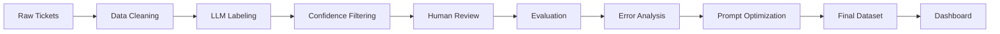
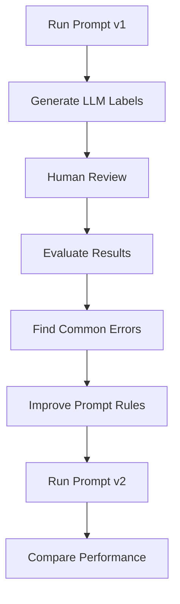
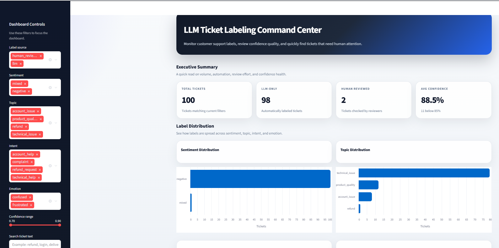
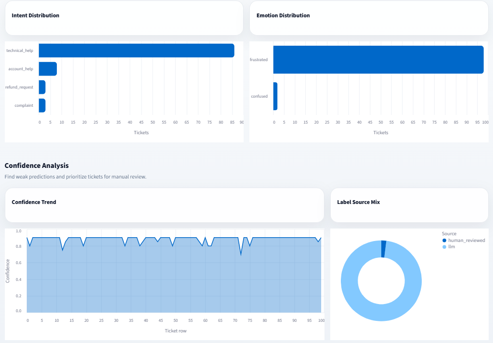

# 🧠 LLM-Based Customer Support Ticket Labeling System

<p align="center">
  
  
  
  
  
</p>

---

## ✨ Overview

<p align="center">
  <strong>A powerful, production-grade pipeline that combines Large Language Models with human intelligence to deliver accurate, scalable, and reliable customer support ticket labeling.</strong>
</p>

---

## 📌 Description

Modern customer support systems generate massive volumes of tickets daily.  
Manual labeling is slow, expensive, and inconsistent.

This project introduces a **smart AI-driven workflow** that:

- ⚡ Automates ticket labeling using LLMs
- 🎯 Improves accuracy with human feedback
- 🔁 Continuously learns through prompt optimization
- 📊 Provides deep insights via interactive dashboards

---

## 🎯 Core Idea

<p align="center">
  <strong>🤖 AI handles scale → 👨‍💻 Humans ensure quality → 📈 System improves over time</strong>
</p>

---

## 🧩 Problem vs Solution

| 🚫 Problem                        | ✅ Solution                          |
| --------------------------------- | ------------------------------------ |
| Manual labeling is slow           | Automated LLM-based classification   |
| Inconsistent annotations          | Structured label system              |
| Hard to scale                     | Pipeline designed for large datasets |
| No feedback loop                  | Human-in-the-loop refinement         |
| Poor model performance visibility | Built-in evaluation & error analysis |

---

## 🏗️ System Architecture (High-Level)

<p align="center">



</p>
## 🌟 Key Highlights

- 🧠 **AI-powered multi-label classification**
- 🎯 **Confidence-based intelligent filtering**
- 👨‍💻 **Beautiful human review interface (Streamlit)**
- 📊 **Advanced evaluation metrics** (F1, Precision, Recall)
- 🔍 **Deep error analysis pipeline**
- 🔁 **Iterative prompt engineering loop**
- 📈 **Interactive analytics dashboard**

## 🚀 Key Features

- 🤖 LLM-based multi-label classification
- 🎯 Confidence-based filtering
- 👨‍💻 Human-in-the-loop review system
- 📊 Evaluation with F1, Precision, Recall
- 🔍 Error analysis pipeline
- 📈 Interactive Streamlit dashboard

---

## 🛠️ Tech Stack

<p align="center">


</p>

---

### 🔧 Technologies Used

| Category              | Technology    |
| --------------------- | ------------- |
| **Programming**       | Python 3.10+  |
| **Data Processing**   | Pandas        |
| **LLM Integration**   | OpenAI API    |
| **Frontend/UI**       | Streamlit     |
| **Evaluation**        | Scikit-learn  |
| **Progress Tracking** | tqdm          |
| **Environment**       | python-dotenv |

---

### ⚙️ Dependencies

```bash
pandas
openai
python-dotenv
tqdm
streamlit
scikit-learn
```

## 📂 Project Structure

```bash
llm-ticket-labeling-system/
│
├── data/
│   ├── customer_support_tickets.csv
│   ├── sample_input.csv
│   ├── llm_labeled_tickets_v2.csv
│   ├── review_queue_v2.csv
│   ├── human_reviewed_tickets_v2.csv
│   └── final_labeled_tickets.csv
│
├── prompts/
│   ├── prompt_v1.txt
│   └── prompt_v2.txt
│
├── src/
│   ├── load_data.py
│   ├── llm_labeler.py
│   ├── review_filter.py
│   ├── evaluate.py
│   ├── error_analysis.py
│   └── create_final_dataset.py
│
├── app/
│   ├── review_app.py
│   └── dashboard.py
│
├── reports/
│   ├── evaluation_report.csv
│   ├── evaluation_report_v2.csv
│   └── error_report.csv
│
├── requirements.txt
└── README.md
```

# ⚙️ Installation & Setup

## 1️⃣ Clone the Repository

git clone https://github.com/your-username/llm-ticket-labeling-system.git
cd llm-ticket-labeling-system

## 2️⃣ Create Virtual Environment (Recommended)

python -m venv venv
source venv/bin/activate # macOS/Linux
venv\Scripts\activate # Windows

## 3️⃣ Install Dependencies

pip install -r requirements.txt

## 4️⃣ Configure Environment Variables

Create a .env file in the root directory:
OPENAI_API_KEY=your_api_key_here
✔ Required for LLM labeling step
✔ Keep this file private (never push to GitHub)

# ▶️ How to Run (Step-by-Step)

## 🧩 Step 1: Prepare Data

python src/load_data.py
✔ Cleans raw dataset
✔ Removes duplicates and empty entries
✔ Creates sample_input.csv

## 🤖 Step 2: Run LLM Labeling

python src/llm_labeler.py
✔ Sends tickets to OpenAI API
✔ Generates structured labels
✔ Saves output to llm_labeled_tickets_v2.csv

## ⚠️ Step 3: Filter for Review

python src/review_filter.py
✔ Identifies low-confidence predictions
✔ Creates review_queue_v2.csv

## 👨‍💻 Step 4: Launch Human Review App

streamlit run app/review_app.py
✔ Opens an interactive review interface
✔ Allows humans to correct AI-generated labels
✔ Saves corrected tickets into human_reviewed_tickets_v2.csv

## 📊 Step 5: Evaluate Model Performance

python src/evaluate.py
✔ Compares LLM labels with human-reviewed labels
✔ Calculates accuracy, precision, recall, and F1 score
✔ Saves the report into evaluation_report_v2.csv

## 🔍 Step 6: Run Error Analysis

python src/error_analysis.py
✔ Finds where the LLM made mistakes
✔ Groups errors by label type
✔ Saves insights into error_report.csv

## 🧹 Step 7: Create Final Dataset

python src/create_final_dataset.py
✔ Combines AI labels with human corrections
✔ Generates the final clean dataset
✔ Saves output as final_labeled_tickets.csv

## 📈 Step 8: Launch Dashboard

streamlit run app/dashboard.py
✔ Opens the analytics dashboard
✔ Shows label distributions
✔ Displays confidence insights
✔ Tracks LLM-only vs human-reviewed labels

# 🧠 Labeling Schema

The system produces structured labels for every customer support ticket.

## Label Types

| Label Type | Purpose                                 | Example Values                            |
| ---------- | --------------------------------------- | ----------------------------------------- |
| Sentiment  | Detects the overall tone of the message | positive, negative, neutral, mixed        |
| Topic      | Identifies the main issue category      | technical_issue, billing_issue, refund    |
| Intent     | Understands what the customer wants     | complaint, refund_request, technical_help |
| Emotion    | Captures the customer’s emotional state | frustrated, confused, angry               |
| Confidence | Measures model certainty                | 0.0 – 1.0                                 |
| Reason     | Explains why the labels were chosen     | "User reports login failure."             |

---

# 🏷️ Supported Labels

## Sentiment

| Label    | Meaning                                   |
| -------- | ----------------------------------------- |
| positive | Customer is happy or satisfied            |
| negative | Customer reports a problem or complaint   |
| neutral  | Customer asks a normal question           |
| mixed    | Customer shows both positive and negative |

### Topic

| Label                | Meaning                                                      |
| -------------------- | ------------------------------------------------------------ |
| **product_quality**  | Product is broken, damaged, defective, or low quality        |
| **delivery**         | Issue with shipping, package, tracking, or late arrival      |
| **pricing**          | Question or complaint about cost, discount, or plan price    |
| **customer_support** | Issue with support response, staff, or service quality       |
| **refund**           | Customer asks for money back or cancellation refund          |
| **technical_issue**  | Problem using software, app, website, device, or system      |
| **account_issue**    | Login, password, verification, or account access issue       |
| **billing_issue**    | Payment, invoice, subscription, charge, or transaction issue |
| **other**            | Used only when no other topic fits                           |

---

### Intent

| Label               | Meaning                                               |
| ------------------- | ----------------------------------------------------- |
| **complaint**       | Customer reports a bad experience                     |
| **question**        | Customer asks for information                         |
| **refund_request**  | Customer wants a refund or return                     |
| **technical_help**  | Customer needs help fixing a technical issue          |
| **account_help**    | Customer needs login, account, or verification help   |
| **billing_help**    | Customer needs payment, invoice, or subscription help |
| **feature_request** | Customer asks for a new feature or improvement        |
| **praise**          | Customer gives positive feedback                      |
| **other**           | Used only when no other intent fits                   |

---

### Emotion

| Label            | Meaning                                |
| ---------------- | -------------------------------------- |
| **happy**        | Customer sounds satisfied or pleased   |
| **angry**        | Customer sounds strongly upset         |
| **frustrated**   | Customer has a problem and needs help  |
| **confused**     | Customer does not understand something |
| **disappointed** | Customer expected a better experience  |
| **neutral**      | No clear emotion is shown              |

---

## 🧪 Prompt Engineering

This project uses an iterative prompt improvement process.

### Prompt v1

The first prompt defines the basic labeling task:

- Return valid JSON only
- Classify sentiment, topic, intent, and emotion
- Provide confidence score
- Give a short reason

---

### Prompt v2

The improved prompt adds stricter decision rules:

- Clear rules for each label type
- Better handling of complaints and technical issues
- More careful use of `neutral`, `mixed`, and `other`
- Confidence scoring guidelines
- Stronger JSON formatting instruction

---

## 🔁 Prompt Improvement Workflow



## 📊 Results & Performance

### 🚀 Improvements Achieved

- ✅ Significant increase in overall labeling accuracy
- 📉 Reduction in classification errors (especially Topic & Intent)
- 🎯 Better consistency across similar tickets
- 🔍 Clear visibility into model weaknesses

---

### 📈 Performance Comparison

| Version       | Accuracy | Precision | Recall   | F1 Score | Notes                         |
| ------------- | -------- | --------- | -------- | -------- | ----------------------------- |
| **Prompt v1** | Lower    | Moderate  | Moderate | Lower    | Basic rules, less consistency |
| **Prompt v2** | Higher   | Higher    | Higher   | Higher   | Improved rules & clarity      |

✔ Prompt v2 performs better due to clearer instructions and structured rules

---

### 📉 Error Reduction Insights

- Reduced confusion between:
  - `billing_issue` vs `pricing`
  - `technical_issue` vs `account_issue`
- Improved sentiment detection in complaint-heavy tickets
- Better intent classification for refund-related queries

---

## 🎥 Demo

### 📊 Dashboard Overview

<p align="center">
  
</p>

- View total tickets, LLM vs human-reviewed distribution
- Monitor overall confidence score
- Track review coverage

---

### 📈 Label & Confidence Analysis

<p align="center">
  
</p>

- Visualize sentiment, topic, intent, and emotion distribution
- Analyze confidence trends over tickets
- Identify weak predictions easily

---

### ⚠️ Review Queue (Low Confidence Tickets)

<p align="center">
  
</p>

- Automatically surfaces low-confidence predictions
- Helps prioritize human review
- Shows label source and confidence levels

---

<p align="center">
  <strong>Experience the system in action</strong>
</p>

---

### 🧠 Human Review App

- Clean, modern UI for reviewing AI predictions
- Real-time correction of labels
- Improves dataset quality through human feedback

---

### 📊 Dashboard

- Visual breakdown of labeled data
- Confidence score distribution
- LLM vs Human-reviewed comparison
- Easy exploration of low-confidence tickets

---

> 🔗 Demo Link: _Add your live demo URL here_

---

## 🌍 Use Cases

This system can be applied in multiple real-world scenarios:

### 🏢 Customer Support Automation

- Auto-classify incoming tickets
- Route tickets to the right teams

### 📊 Data Analytics

- Analyze customer sentiment trends
- Identify common issues and pain points

### 🤖 AI Model Training

- Generate high-quality labeled datasets
- Improve supervised learning pipelines

### ⚡ Workflow Optimization

- Reduce manual workload
- Improve response time and efficiency

---

## 🤝 Contributing

Contributions are welcome!

### 💡 Ways to Contribute

- Improve prompt design
- Add new label categories
- Enhance dashboard features
- Optimize pipeline performance

---

### 🛠️ Steps to Contribute

```bash
# Fork the repository
# Create a new branch
git checkout -b feature/your-feature-name

# Make changes and commit
git commit -m "Add new feature"

# Push to GitHub
git push origin feature/your-feature-name

# Open a Pull Request
```

# 📜 License

This project is licensed under the MIT License.

---

# 👤 Author

<p align="center">
  <strong>Nahian Bin Rahman</strong><br/>
  AI Engineer
</p>

<p align="center">
  
  
</p>

---

# ⭐ Support

If you found this project helpful:

- ⭐ Star the repository
- 🍴 Fork it
- 📢 Share it with others

<p align="center">
  <strong>Built with ❤️ using AI + Human Intelligence</strong>
</p>
